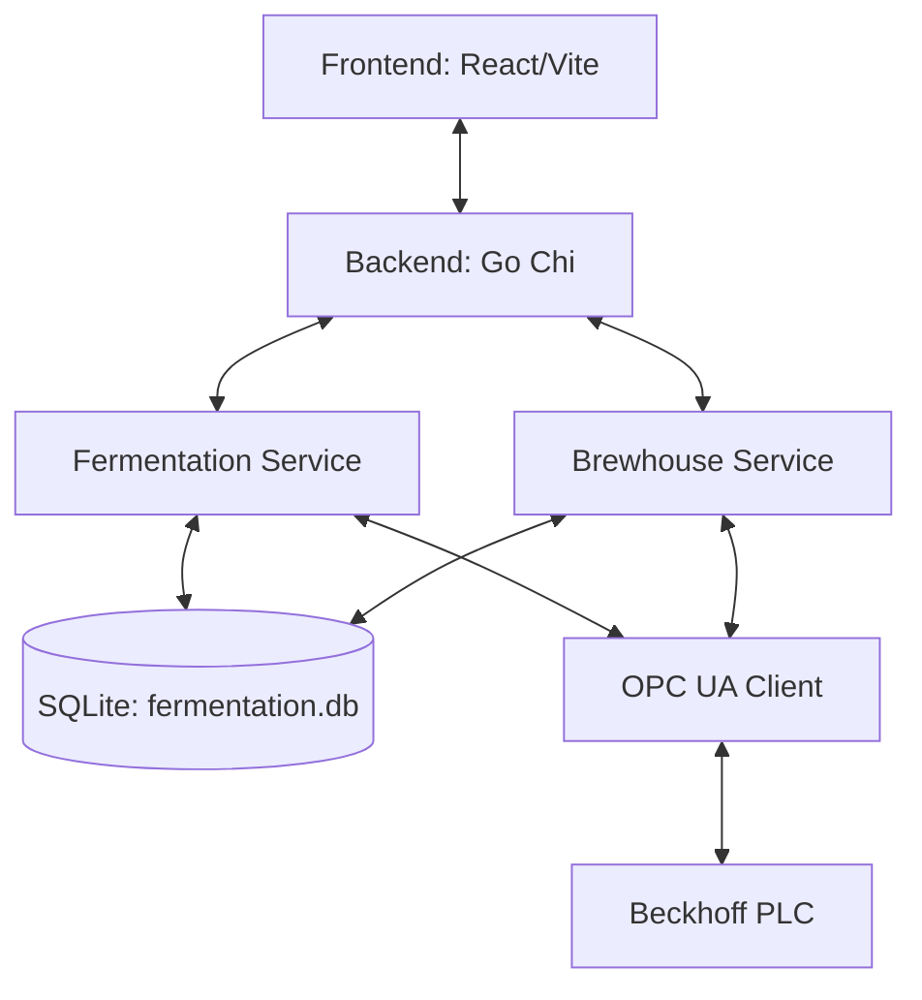

# AI_RULES.md — goTOV Project Context

Compact reference for AI agents to understand the project structure and technical details.

## Architecture Diagram

## Database Schema

### fermentation.db
- **fermentation_plans**: `id`, `name`, `recipe_id`, `total_steps`
- **fermentation_steps**: `id`, `plan_id`, `step_number`, `temperature`, `duration_hours`
- **fermentation_states**: `id`, `plan_id`, `tank_id`, `batch_id`, `step_index`, `status`, `mode`
- **fermentation_history**: `timestamp`, `temperature`, `target_temp`, `cooling_valve`, `heating_jacket`
- **brewhouse_state**: `id`=1, `state_json`
- **brewhouse_history**: `timestamp`, `mlt_temp`, `bk_temp`, `mlt_padraag`, `bk_padraag`

## API Endpoints

### Fermentation
- `GET /api/fermentation/plans` — List plans
- `POST /api/fermentation/start` — Start (planId, tankId, batchId)
- `POST /api/fermentation/stop` — Stop (id/tankId)
- `GET /api/fermentation/status` — Current active fermentations

### Brewhouse
- `GET /api/brewing/status` — Current brewing session
- `POST /api/brewing/config/pid` — Save PID config

### PLC / Infrastructure
- `GET /api/tags` — Current tag snapshot
- `POST /api/write` — Write to tag (tag, value)
- `GET /api/stream/tags` — WebSocket real-time updates

## OPCUA Tag Map

- **Valves**: `MAIN.fbUA.V1_VannInn` to `V9_ChillerOut`
- **Temps**: `MAIN.fbUA.bkTemp`, `mltTemp`, `fermenter1Temp`, `fermenter2Temp`
- **Heaters**: `MAIN.fbUA.bkHeaterPower`, `hltHeaterPower`
- **Pumps**: `MAIN.fbUA.pumpeHLT`, `pumpeWort`

## Naming Conventions

- **Database**: `snake_case` (e.g., `batch_id`)
- **API (JSON)**: `camelCase` (e.g., `planId`)
- **Go**: `PascalCase` for Exports, `camelCase` for internal
- **Tags**: `MAIN.fbUA.tag_name`
